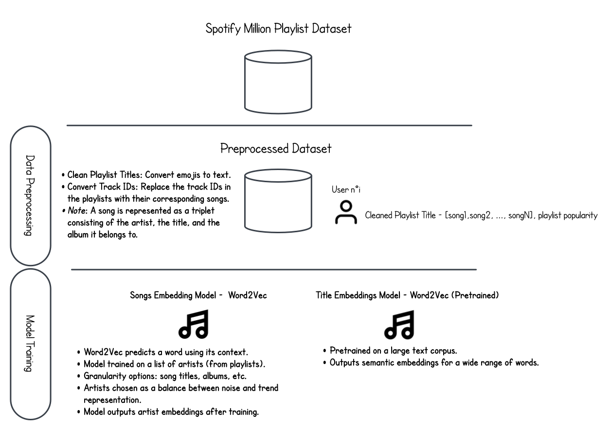
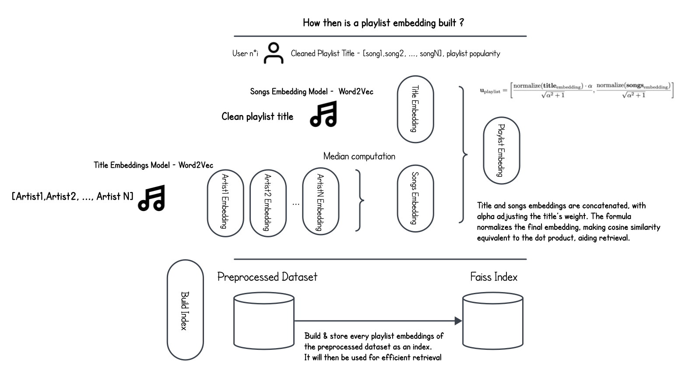
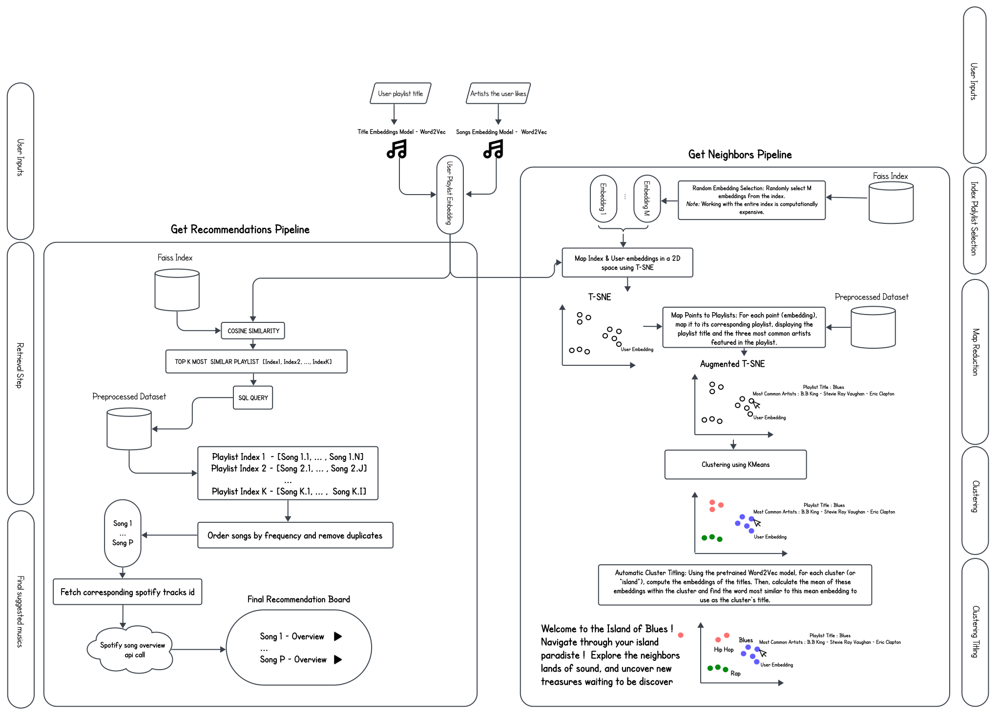

<div align="center">
  
</div>

Your Personalized Music Companion

Discover, explore, and play your favorite tracks with LucileJams. Trained on the Spotify Million Playlist Dataset, LucileJams offers a sophisticated recommendation pipeline built from scratch. Simply input a title and artists you love, and LucileJams will provide you with the next best songs to listen to. Inspired by the legendary guitar of B.B. King, LucileJams combines elegance and functionality to bring you an unparalleled musical experience. Tune in and let LucileJams be the soundtrack to your life.

# Workflow

### Overview

What can we do with user-generated playlists, and how can we create an algorithm from scratch to automate recommendations for other users? The core idea driving this project's architecture is to map playlists in a high-dimensional space and then use similarity to generate recommendations. 

The main challenge then becomes: **How can we create meaningful embeddings from the training set available?**

To briefly explain, the **Spotify Million Playlist Dataset** consists of user-created playlists made up of songs, where each song is represented by its album, title, and artist. No additional metadata, such as lyrics, was provided.

Inspired by the classical Word2Vec architecture, which predicts a word based on its neighbors, we aim to apply similar principles here. Word2Vec has historically shown great success in generating meaningful embeddings.

The following diagrams explain the structure of the project. As the saying goes, "a picture is worth a thousand words."

## How is the model trained?

<div align="center">
  
</div>

## How is a playlist embedding created?

<div align="center">
  
</div>

## How do all the components come together to generate recommendations and find similar playlists?

<div align="center">
  
</div>


# Instructions 

## Prerequisites

Before running the app, make sure you have the following installed:

Make sure you have the following installed:
- **Python 3.x** (You can check your Python version by running `python --version` or `python3 --version`)
- **pip** (Python package installer)
- **Unzip utility** (For unzipping `.gz` files. Most Linux/macOS systems have this pre-installed; on Windows, you can use tools like [7-Zip](https://www.7-zip.org/).)


## 1. Clone the Repository

To download the app, clone the repository from GitHub using the following command:

```bash
git clone https://github.com/tomargentin0901/LucilleJams
```
Navigate into the project directory : 

```bash
cd LucilleJams
```

## 2. Install Required Dependencies

The app uses Python dependencies listed in the `requirements.txt` file. Install them with the following command:


```bash
pip install -r requirements.txt
```


### (Optional) Create a Virtual Environment


To avoid conflicts with other Python projects, it's recommended to create a virtual environment:

For **macOS/Linux**:

```bash
python3 -m venv venv
source venv/bin/activate
```

For **Windows**:

```bash
python -m venv venv
venv\Scripts\activate
```

(Optional) Create a Virtual Environment
To avoid conflicts with other Python projects, it's recommended to create a virtual environment:

Then install the dependencies:

```bash
pip install -r requirements.txt
```

## 3. Download, Merge and Unzip Required Data Files

Before running the app, download the required files from the GitHub release. Since the FAISS index is split into multiple parts, you need to download all parts and then merge them.

### Download the Files:

1. [FAISS Index Part 1](https://github.com/tomargentin0901/LucilleJams/releases/download/1.0.0/faiss.index.part-aa)
2. [FAISS Index Part 2](https://github.com/tomargentin0901/LucilleJams/releases/download/1.0.0/faiss.index.part-ab)
3. [Spotify Dataset](https://github.com/tomargentin0901/LucilleJams/releases/download/1.0.0/spotify_dataset.gz)


**Once the download is complete, move the downloaded files into the GitHub repository folder.**

### Merge the FAISS Index Parts:
After downloading all FAISS index parts, merge them into a single file using the following command:

```bash
cat faiss.index.part-* > embeddings_faiss.index && rm faiss.index.part-*
```

### Unzip the Spotify Dataset:

The Spotify dataset is already included in the repository as a .gz file. You will need to unzip it.

For **macOS/Linux**:

```bash
gunzip spotify_dataset.gz && mv spotify_dataset spotify_dataset.db
```

For **Windows**:

Use a tool like  [7-Zip](https://www.7-zip.org/) to unzip the file. Right-click the spotify_dataset.gz file and select "Extract Here". The extracted file should have a `.db` extension. Rename it if needed.

Your project folder should look like this:

```plaintext
LucilleJams/
│
├── app.py
├── faiss.index
├── your-pickle-file.pkl
├── spotify_dataset.db
├── requirements.txt
├── README.md
├── config/
│   ├── config_word2vec.py
│   ├── emoji_name_to_text.py
│   ├── tokenizer_config.py
├── models/
│   ├── embeddings.py
│   ├── songs_model.pickle
│   ├── title_model.pickle
└── utils/
    ├── dataset_utils.py
    ├── inference_utils.py
    ├── visualization_utils.py

```

## 4. Run the app 

Once all files are in place, you can run the app using the following command:

```bash
python -m app.app
```

After running the command, open your web browser and navigate to [http://127.0.0.1:8050/](http://127.0.0.1:8050) to access the application.

---


